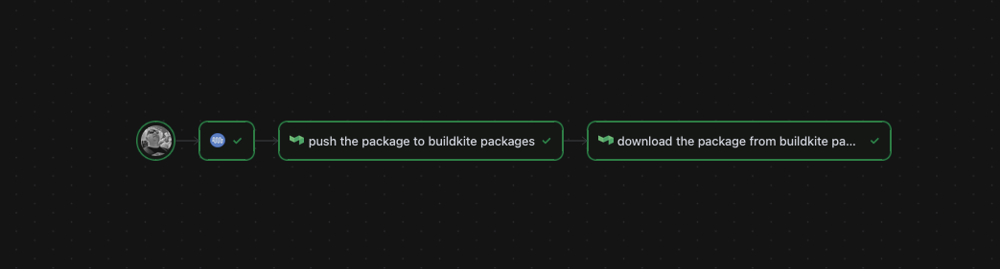

# packages-for-files-example

Example buildkite pipeline illustrating how buildkite packages can be used to store a file, and read the latest version between builds.

# Overview

* A pipeline can publish, and read the last version of a package.
* Uses OIDC to establish a trust between the pipeline and the package repository, see https://buildkite.com/docs/package-registries/security/oidc for more details.
* Uses the packages api to list and select the latest version of the package. see https://buildkite.com/docs/apis/rest-api/package-registries/registries for more details.



## OIDC Policy

Once you have created a package repository, in this example it is named `autopkg`, you can go into the settings, then into OIDC policy and update it as follows. Note you will need to change `my-org-slug-here` to the slug of your organization.

```yaml
- iss: https://agent.buildkite.com
  claims:
    organization_slug:
      equals: my-org-slug-here
    pipeline_slug:
      in:
        - packages-for-files-example
```

